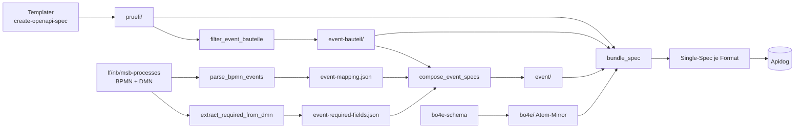

# maco-api-doc-resources

Source of Truth für die in Apidog gerenderte **BO4E-API-Doku** (Prüfi- und Event-OpenAPI-Specs). Apidog importiert aus diesem Repo — keine manuelle Apidog-Pflege mehr.

## Repo-Topologie

- **`main` trägt nur das Tooling** — die Generator-Pipeline unter `scripts/` (inkl. Bundler `bundle_spec.py`). **Kein generierter Output auf `main`.**
- **Generierter Output lebt pro Formatversion auf eigenen Branches `v<format>`** (z. B. `v202604`): je Branch die Specs (`bo4e/`, `pruefi/`, `event-bauteil/`, `event/`) plus eine gebündelte Single-Spec als Apidog-Importartefakt.
- Welche Formate existieren, ergibt sich aus den Camunda-Prozessdateien. **Historisierung:** Formate, die dort nicht mehr vorkommen, bleiben als eingefrorener `v<format>`-Branch erhalten (werden nicht mehr angefasst).
- Erzeugt + aktualisiert wird der Output vom **Sync-Workflow** ([MACO-13087](https://conuti.atlassian.net/browse/MACO-13087), in Arbeit). Output ist regenerierbar, kein Source.

## Pipeline (Überblick)

Templater (`create-openapi-spec`) liefert `pruefi/` + den `bo4e/`-Atom-Mirror; danach die vier Python-Skripte und der Bundler:

1. `filter_event_bauteile.py` → `event-bauteil/` (Prüfi-Spec minus `transaktionsdaten`)
2. `parse_bpmn_events.py` → `event-mapping.json` (Topic↔Prüfi aus Camunda-BPMN)
3. `extract_required_from_dmn.py` → `event-required-fields.json` (Required-Felder aus DMN)
4. `compose_event_specs.py` → `event/` (Event-Specs)
5. `bundle_spec.py` → **eine OpenAPI-3.1-Single-Spec je Format** (das Apidog-Importartefakt)

Skript-Details, Flags und Reproduzier-Befehle: **[`scripts/README.md`](scripts/README.md)**. Output ist deterministisch (byte-identisch bei gleichen Eingaben); Tests via `pytest scripts/tests`.

## Spec-Formate (kurz)

- **Prüfi** (`pruefi/<format>/<scope>/PI_<id>.yaml`): OpenAPI 3.1, Container-Subset-Schemas pro Tiefenebene; skalare Leaves als `$ref` auf atomare `bo4e/fields/<cdoc|bo|com>/...`-Files (Single-Source); `x-edifact-segment`-Extension; `required` pro Container. Kein `paths` — reine Schema-Library für Composition.
- **Event-Bauteil** (`event-bauteil/...`): Prüfi-Spec ohne `transaktionsdaten` (= Stammdaten-Anforderungen eines PI).
- **Event** (`event/<format>/[<ROLLE>]_<Topic>.yaml`): `stammdaten` (`oneOf` über die Event-Bauteile des Topics) + `transaktionsdaten` (Objekt mit genau den vom DMN gelesenen Feldern) + `zusatzdaten` (`eventname.const`). Coverage-Lücken transparent via `x-pending-pruefis`/Stub.

## Tickets

| Bereich | Ticket |
|---|---|
| Generator-Skripte | [MACO-13040](https://conuti.atlassian.net/browse/MACO-13040) (fertig) |
| Sync-Workflow (GHA-Automatisierung + Bundle + `v<format>`-Branches) | [MACO-13087](https://conuti.atlassian.net/browse/MACO-13087) |
| EN-Pfad (`bo4e-en/`, EN-Specs) | [MACO-13088](https://conuti.atlassian.net/browse/MACO-13088) |
| Apidog-Einbindung | [MACO-13041](https://conuti.atlassian.net/browse/MACO-13041) |

Epic: [MACO-13032](https://conuti.atlassian.net/browse/MACO-13032) — BO4E EN-Unterstützung für externe Schnittstellen.
