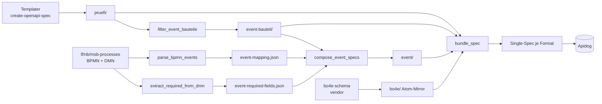

# maco-api-doc-resources

Source of Truth für die in Apidog gerenderte **BO4E-API-Doku** (Prüfi- und Event-OpenAPI-Specs), DE **und** EN. Apidog importiert die gebündelte Single-Spec aus diesem Repo — keine manuelle Apidog-Pflege mehr.

## Repo-Topologie

- **`main` trägt nur das Tooling** — die Generator-Pipeline unter `scripts/` (inkl. Bundler `bundle_spec.py`), die Workflows und das Dev-Image. **Kein generierter Output auf `main`.**
- **Generierter Output lebt pro Formatversion auf eigenen Branches `v<format>`** (z. B. `v202604`). Je Branch:
  - **DE:** `bo4e/`, `pruefi/`, `event-bauteil/`, `event/` + Bundle `bundle/maco-bo4e-<format>.openapi.yaml`
  - **EN:** `bo4e-en/`, `pruefi-en/`, `event-bauteil-en/`, `event-en/` + Bundle `bundle/maco-bo4e-<format>-en.openapi.yaml`
- **Welche Formate existieren, bestimmt der Templater** — er emittiert Prüfi-Specs nur für die unterstützten Versionen (aktuelle + vorige, plus die im Aufbau). **Historisierung:** ein Format, für das der Templater keine Specs mehr liefert, wird nicht regeneriert; sein `v<format>`-Branch bleibt eingefroren.
- Erzeugt + aktualisiert wird der Output vom **Sync-Workflow** ([MACO-13087](https://conuti.atlassian.net/browse/MACO-13087)). Output ist regenerierbar, kein Source.

## Pipeline (Überblick)

Templater (`create-openapi-spec`) liefert `pruefi/` + den `bo4e/`-Atom-Mirror; danach die vier Python-Skripte und der Bundler (DE):



1. `filter_event_bauteile.py` → `event-bauteil/` (Prüfi-Spec minus `transaktionsdaten`)
2. `parse_bpmn_events.py` → `event-mapping.json` (Topic↔Prüfi aus Camunda-BPMN)
3. `extract_required_from_dmn.py` → `event-required-fields.json` (Required-Felder aus DMN)
4. `compose_event_specs.py` → `event/` (Event-Specs)
5. `bundle_spec.py` → **eine OpenAPI-3.1-Single-Spec je Format** (das Apidog-Importartefakt)

**EN-Seite** (parallel, [MACO-13088](https://conuti.atlassian.net/browse/MACO-13088)): `bo4e-en/` = Mirror von [`bo4e-schema-en`](https://github.com/conuti-gmbh/bo4e-schema-en) (kanonische EN-Atome, Version aus `composer.lock` → konsistent zum DE-Schema). Jede `pruefi/`-Spec wird per `translate_specs.py` über den **bo4e-translator**-OpenAPI-Endpoint übersetzt → `pruefi-en/` (Property-Namen + Enums übersetzt, `$ref` auf `bo4e-en/`); Container-/Schema-Namen bleiben DE (Apidog-Konvention), `eventname.const` bleibt DE (Camunda-Correlation). Danach dieselben Skripte (`filter`/`compose`) + `bundle_spec` mit `bo4e-en`-Katalog → EN-Bundle.

Skript-Details, Flags und Reproduzier-Befehle: **[`scripts/README.md`](scripts/README.md)**. Output ist deterministisch (byte-identisch bei gleichen Eingaben).

## Lokale Entwicklung

Tooling läuft containerisiert (Python + `vacuum`, gepinnt = CI) — **außer Docker ist nichts lokal nötig**:

```bash
make build   # Dev-Image bauen (einmalig / nach Dep- oder vacuum-Bump)
make test    # pytest scripts/tests
make lint    # OpenAPI-3.1-Lint (vacuum) über vorhandene Spec-Dirs
make refs    # $ref-Konsistenzcheck
make shell   # interaktive Shell im Image
```

Image: [`docker/dev/Dockerfile`](docker/dev/Dockerfile) (Python 3.13 + `ruamel`/`pytest` aus [`scripts/requirements.txt`](scripts/requirements.txt) + `vacuum` 0.29.4). Der **volle Sync** (Templater-PHP, Rust-Translator, Process-Repos) ist multi-runtime/cross-repo und läuft nur in der GHA — nicht im Dev-Image.

## Sync-Workflow (GHA)

[`​.github/workflows/sync.yaml`](.github/workflows/sync.yaml) — UI-Trigger: Actions → *Sync BO4E API Doc Resources* → *Run workflow*. Inputs:

| Input | Default | Quelle |
|---|---|---|
| `templater_ref` | `main` | `maco-templater-app` — liefert `pruefi/` + den `bo4e/`-Atom-Mirror (`vendor/conuti/bo4e-schema`) |
| `processes_ref` | `dev` | die drei `maco-{lf,nb,msb}-processes` — Event-Mapping (BPMN) + Required-Felder (DMN) |
| `translator_ref` | `main` | `maco-bo4e-translator-app` — wird aus Source gebaut + lokal für die EN-Übersetzung gefahren |

**Ablauf:**

1. **PHP im Templater-`webserver`-Image** (`docker compose build/up` + `make install` + `create-openapi-spec --strict`) — `shivammathur/setup-php` ist nicht org-allowlisted, daher das org-erprobte Image-Muster.
2. `pruefi/` ← Templater-Output, `bo4e/` ← Templater-`vendor`-Mirror (rsync `--delete`)
3. Drei Process-Repos auschecken, vier Generator-Skripte (`1 → 2 ∥ 4 → 3`)
4. **EN:** `bo4e-schema-en`@`<schema-version>` mirrorn → `pruefi/`→`pruefi-en/` per-File übersetzen (lokal gebauter Translator) → `filter`/`compose` für EN
5. `$ref`-Konsistenz ([`scripts/check_refs.py`](scripts/check_refs.py)) + OpenAPI-3.1-Lint (`vacuum`, [`vacuum-ruleset.yaml`](vacuum-ruleset.yaml)) für DE + EN
6. `bundle_spec.py` je Format → DE- und EN-Bundle
7. **Push je Format auf `v<format>`** (basiert auf bestehendem `origin/v<format>`, sonst `main`; Commit *on top* = fast-forward). Commit-Trailer: Quell-SHAs (Templater + 3 Process-Repos + `bo4e-schema` + `bo4e-schema-en` + Translator). Kein Diff → kein Commit.

**Format-Discovery:** aus dem Templater-`pruefi/`-Output (Templater ist die maßgebliche Format-Quelle). Formate, die nur noch in den Process-Repos liegen, werden übersprungen.

**Auth:** `ID_RSA` (SSH-Deploy-Key) für die privaten Checkouts + den Templater-Image-Build-Arg; `GITHUB_TOKEN` für den Self-Push auf die `v<format>`-Branches. Kein ECR/IAM (der Translator wird aus Source gebaut).

**PR-Gate** [`​.github/workflows/openapi_lint.yaml`](.github/workflows/openapi_lint.yaml): PRs gegen `main` → `pytest scripts/tests`; PRs gegen `v*` → `$ref`-Check + vacuum-Lint.

## Spec-Formate (kurz)

- **Prüfi** (`pruefi/<format>/<scope>/PI_<id>.yaml`): OpenAPI 3.1, Container-Subset-Schemas pro Tiefenebene; skalare Leaves als `$ref` auf atomare `bo4e/fields/<cdoc|bo|com>/...`-Files (Single-Source); `x-edifact-segment`-Extension; `required` pro Container. Kein `paths` — reine Schema-Library für Composition.
- **Event-Bauteil** (`event-bauteil/...`): Prüfi-Spec ohne `transaktionsdaten` (= Stammdaten-Anforderungen eines PI).
- **Event** (`event/<format>/[<ROLLE>]_<Topic>.yaml`): `stammdaten` (`oneOf` über die Event-Bauteile des Topics) + `transaktionsdaten` (Objekt mit genau den vom DMN gelesenen Feldern) + `zusatzdaten` (`eventname.const`). Coverage-Lücken transparent via `x-pending-pruefis`/Stub.
- **EN-Pendants** (`*-en/`): strukturgleich, `$ref` auf `bo4e-en/` (kanonisches `bo4e-schema-en`); Property-Namen/Enums EN, Schema-Namen + `eventname` DE.

## Tickets

| Bereich | Ticket |
|---|---|
| Generator-Skripte | [MACO-13040](https://conuti.atlassian.net/browse/MACO-13040) — Fertig |
| Sync-Workflow (GHA + Bundle + `v<format>`-Branches) | [MACO-13087](https://conuti.atlassian.net/browse/MACO-13087) — Fertig |
| EN-Pfad (`bo4e-en/` + EN-Specs + EN-Bundle) | [MACO-13088](https://conuti.atlassian.net/browse/MACO-13088) — in Entwicklung |
| Apidog-Einbindung | [MACO-13041](https://conuti.atlassian.net/browse/MACO-13041) |

Epic: [MACO-13032](https://conuti.atlassian.net/browse/MACO-13032) — BO4E EN-Unterstützung für externe Schnittstellen.
